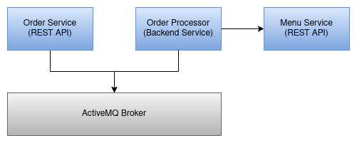

# EzFood: Online Food Ordering Platform

[](https://github.com/ballerina-platform/module-ballerinax-java.jms)

_Authors_: @ayeshLK \
_Reviewers_: @NipunaRanasinghe \
_Created_: 2024/01/26 \
_Updated_: 2024/01/26

## Overview

EzFood is an online food ordering platform designed to simplify the process of placing and processing food orders. The system consists of three main components: Order Service, Order Processor, and Menu Service.

1. **Order Service:**
   - Provides REST API capabilities for customers to place orders, view order status, and complete payments.
   - Manages the overall order lifecycle, from order placement to completion or cancellation.

2. **Order Processor:**
   - Backend service responsible for processing order information.
   - Calculates the total price for orders and estimates the time of completion.
   - Communicates with the Order Service using JMS queues to exchange order details and confirmations.

3. **Menu Service:**
   - Manages the menu of the food items available for ordering.
   - Provides API endpoints for retrieving the entire menu and details for specific items.

This application is written using the [Ballerina](https://ballerina.io/) programming language. Ballerina `java.jms` package is used for JMS integration.

### System Architecture

The EzFood system follows a microservices architecture, with distinct components handling specific functionalities. The communication between services is facilitated by Java Message Service (JMS), ensuring a reliable and asynchronous messaging pattern.

|  | 
|:--------------------------------------------------------------------------------:| 
|                          *Image 1: System components*                            |

## Deploying the system

### Starting Menu Service

Go into the `menu-svc` directory and execute the following command:

```sh
bal run
```

### Starting Order Service

Go into the `order-svc` directory and execute the following command:

```sh
bal run
```

### Starting the Order Processor

Go into the `order-processor` directory and execute the following command:

```sh
bal run
```

### Deploying the system in docker

1. Execute `build-docker-images.sh` script.

```sh
sh build-docker-images.sh
```

2. Run the following command.

```sh
docker compose up
```

## Test the system

- Install VSCode [REST client](https://marketplace.visualstudio.com/items?itemName=humao.rest-client) plugin. 
- Open the `online-food-delivery-request.http` from the VSCode and execute the requests.
